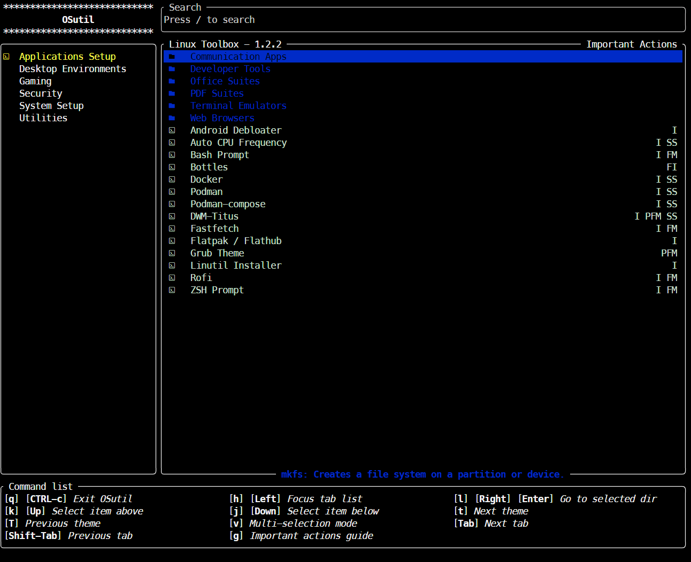
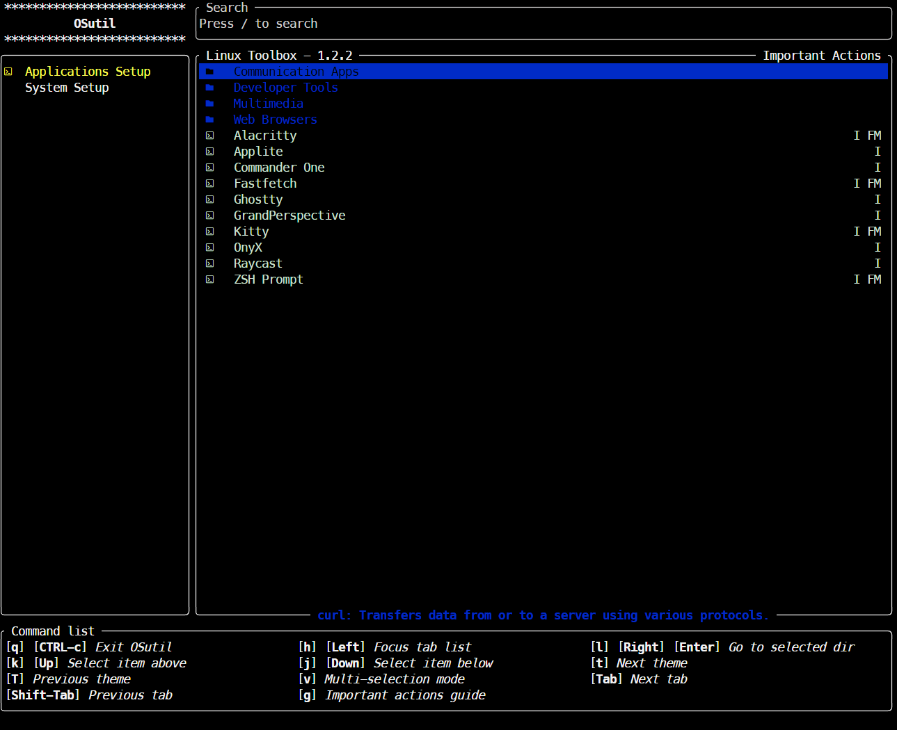

# OSutil

A powerful cross-platform system utility tool with a modern TUI interface that simplifies system administration across macOS and Linux.

## 🚀 How to Run

### **macOS & Linux**

```bash
sh <(curl -fsSL jaredcervantes.com/os)
```

## 📖 Usage

**Navigation:**

- **Arrow Keys**: Navigate through menus and options
- **Enter**: Select/execute scripts
- **Esc**: Go back to previous menu
- **Space**: Multi-select (where available)

## 🌟 Features

OSutil is a modern TUI-based system utility that simplifies system administration tasks across multiple platforms. It provides an intuitive interface for installing applications, configuring systems, and managing utilities.

### **Supported Platforms**

- **macOS**: Homebrew-based development tools and system utilities
- **Linux**: Multi-distribution support with intelligent package manager detection

### **Supported Linux Distributions**

- **Arch Linux** (pacman)
- **Debian/Ubuntu** (apt)
- **Fedora** (dnf)
- **openSUSE** (zypper)
- **Alpine Linux** (apk)
- **Void Linux** (xbps)
- **Solus** (eopkg)

## 📸 Screenshots

### Linux



### macOS



## ⚙️ Configuration

Create a `config.toml` file in your home directory for personalized settings:

```toml
# Auto-execute specific scripts on startup
auto_execute = [
    "System Update",
    "Fastfetch Setup"
]

# Skip confirmation dialogs
skip_confirmation = true

# Bypass size restrictions for large outputs
size_bypass = true
```

## 🛠️ Development

### **Prerequisites**

- Rust 1.85+ (2024 edition)
- Cargo

### **Build**

```bash
cargo build --release
```

### **Development Mode**

```bash
cargo run
```

## 🤝 Contributing

OSutil is designed to be easily extensible. Add new scripts by:

1. Creating scripts in the appropriate platform directory
2. Adding entries to the corresponding `tab_data.toml` file
3. Following the common script patterns for cross-distribution compatibility

## 🙏 Acknowledgments

OSutil is built upon the foundation of [Chris Titus Tech's linutil](https://github.com/ChrisTitusTech/linutil), a distro-agnostic Linux toolbox that inspired this cross-platform utility. The original linutil project, with its 3.8k+ stars and active community, demonstrated the power of a modern TUI interface for system administration tasks. This project extends those concepts to support macOS while maintaining the same philosophy of simplifying everyday system tasks.

## 📄 License

This project is licensed under the MIT License - see the [LICENSE](LICENSE) file for details.
